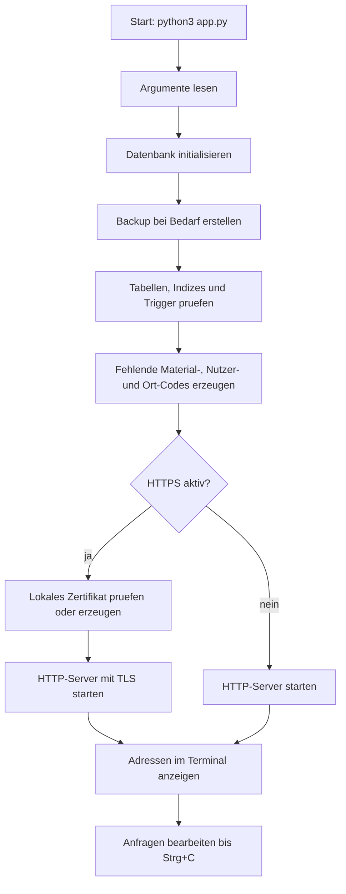
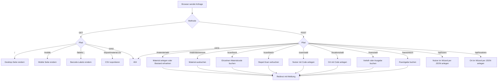
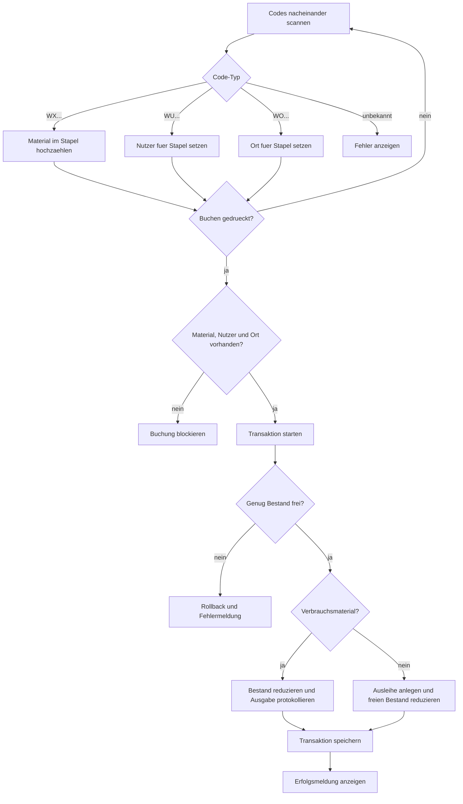
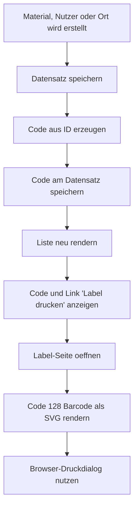

# Programmlaufdiagramm

Dieses Dokument beschreibt den groben Ablauf der Warenwirtschaft-App. Die Diagramme
sind in Mermaid geschrieben und werden auf GitHub direkt gerendert.

## Serverstart

## Anfrageverarbeitung

## Stapel-Scan fuer Verleih oder Ausgabe

## Label-Erstellung

